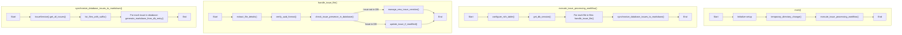

```mermaid
flowchart TB
    subgraph main ["main()"]
        start_main["Start"]
        initialize_setup["Initialize setup"]
        temporary_directory_change["temporary_directory_change()"]
        execute_issue_workflow["execute_issue_processing_workflow()"]
        end_main["End"]
        start_main --> initialize_setup
        initialize_setup --> temporary_directory_change
        temporary_directory_change --> execute_issue_workflow
        execute_issue_workflow --> end_main
    end

    subgraph execute_issue_processing_workflow ["execute_issue_processing_workflow()"]
        start_workflow["Start"]
        configure_table["configure_rich_table()"]
        get_db_session["get_db_session()"]
        process_files["For each file in files: handle_issue_file()"]
        sync_db_to_md["synchronize_database_issues_to_markdown()"]
        end_workflow["End"]
        start_workflow --> configure_table
        configure_table --> get_db_session
        get_db_session --> process_files
        process_files --> sync_db_to_md
        sync_db_to_md --> end_workflow
    end

    subgraph handle_issue_file ["handle_issue_file()"]
        start_handle["Start"]
        extract_details["extract_file_details()"]
        verify_uuid["verify_uuid_format()"]
        check_db_presence["check_issue_presence_in_database()"]
        manage_new_issue["manage_new_issue_creation()"]
        update_issue["update_issue_if_modified()"]
        end_handle["End"]
        start_handle --> extract_details
        extract_details --> verify_uuid
        verify_uuid --> check_db_presence
        check_db_presence -->|Issue not in DB| manage_new_issue
        check_db_presence -->|Issue in DB| update_issue
        manage_new_issue --> end_handle
        update_issue --> end_handle
    end

    subgraph synchronize_database_issues_to_markdown ["synchronize_database_issues_to_markdown()"]
        start_sync["Start"]
        get_all_issues["IssueService().get_all_issues()"]
        list_files["list_files_with_suffix()"]
        for_each_issue["For each issue in database: generate_markdown_from_db_entry()"]
        end_sync["End"]
        start_sync --> get_all_issues
        get_all_issues --> list_files
        list_files --> for_each_issue
        for_each_issue --> end_sync
    end

    click temporary_directory_change "callback" "Change working directory temporarily"
    click execute_issue_workflow "callback" "Handle issue processing and DB synchronization"
    click handle_issue_file "callback" "Handle a single issue file"
    click synchronize_database_issues_to_markdown "callback" "Synchronize issues from DB to markdown"
```
