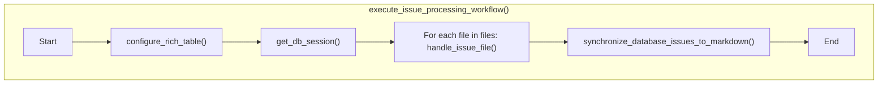

```mermaid
flowchart TB

    subgraph execute_issue_processing_workflow ["execute_issue_processing_workflow()"]
        start_workflow["Start"]
        configure_table["configure_rich_table()"]
        get_db_session["get_db_session()"]
        process_files["For each file in files: handle_issue_file()"]
        sync_db_to_md["synchronize_database_issues_to_markdown()"]
        end_workflow["End"]
        start_workflow --> configure_table
        configure_table --> get_db_session
        get_db_session --> process_files
        process_files --> sync_db_to_md
        sync_db_to_md --> end_workflow
    end

    click temporary_directory_change "callback" "Change working directory temporarily"
    click execute_issue_workflow "callback" "Handle issue processing and DB synchronization"
    click handle_issue_file "callback" "Handle a single issue file"
    click synchronize_database_issues_to_markdown "callback" "Synchronize issues from DB to markdown"
```
