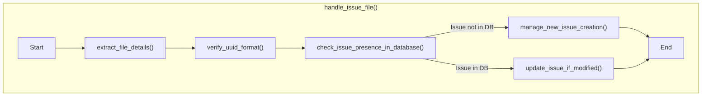

```mermaid
flowchart TB

    subgraph handle_issue_file ["handle_issue_file()"]
        start_handle["Start"]
        extract_details["extract_file_details()"]
        verify_uuid["verify_uuid_format()"]
        check_db_presence["check_issue_presence_in_database()"]
        manage_new_issue["manage_new_issue_creation()"]
        update_issue["update_issue_if_modified()"]
        end_handle["End"]
        start_handle --> extract_details
        extract_details --> verify_uuid
        verify_uuid --> check_db_presence
        check_db_presence -->|Issue not in DB| manage_new_issue
        check_db_presence -->|Issue in DB| update_issue
        manage_new_issue --> end_handle
        update_issue --> end_handle
    end

```
